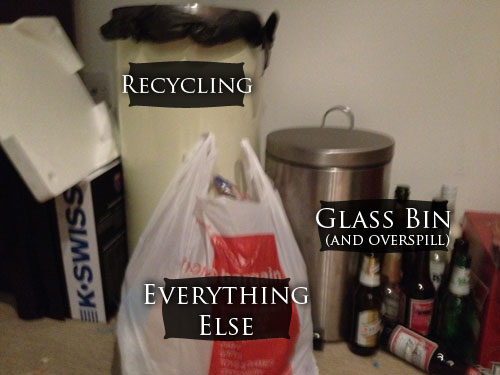
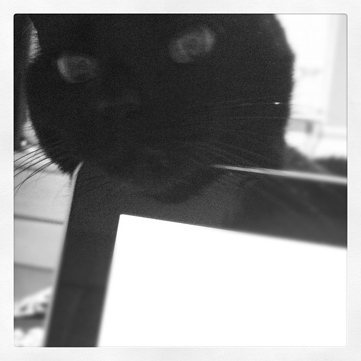
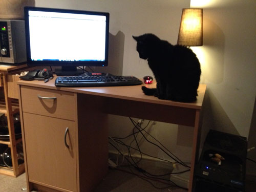
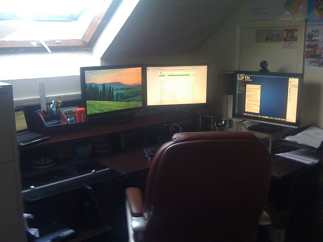

There are a lot of posts on the Internet at the moment about the Mayan prophecies and all that rubbish, I have no doubt that life will go on after 2012 and I want it to be better than it currently is.

<!-- end -->

For most of my adult life I have been into the idea of self improvement and as a result I have acquired a great many skills over the years. However since becoming single for the first time in my adult life in mid-2010 I decided to switch my self improvement focus from learning fun new skills to loftier goals with a view to making some real changes to my life, I have already made some good progress with these changes but this year I am going to go all out into achieving as many of my goals on the list below as I possibly can.

I have divided the list into categories as each category focuses on a different area of my life:

## Health

Self explanatory really, my goal here is to improve the condition of my body. As pretty much every one of my friends tell me, I am very unhealthy and need to do something about it. I am currently 220lbs which is considerably lighter than this time last year but still far from light enough. Plus I want to tone up a little and increase my general fitness.

### Goals for this category:

#### Reach target weight of 155lbs

As I mentioned above, I am quite overweight, whilst I’m not massive (although I have been there) I am determined to make this year the year I _really_ make a change in my life so instead of just getting to a point where I don’t look like crap, I want to get fit. The main way I'm doing it is through improving my diet, I've been using [My Fitness Pal](http://www.myfitnesspal.com) for a while now which has contributed to nearly all the progress I've made so far. Getting down to my ideal body weight is only step one though.

#### Attend martial arts classes

Becoming fighting fit is step two. Don’t get me wrong, I’m never going to be an exercise addict, ever. I don’t really enjoy it enough. I attended my first kickboxing class tonight and whilst it was a lot of fun, it was still work. Plus I have no desire to be ripped, I don’t need a six-pack or biceps that could punch through a bus. I’d just like to look better than I do now and live longer than I will if I continue as I am.

## Environment

By ‘environment’ I don’t mean the world and it’s plethora of issues (although they are included). The aim of these goals is to improve my immediate environment, IE: My Apartment.

### **Goals for this category:**

#### Set up a sustainable recycling system

I _do_ currently have a recycling system, this is it:

 

Whilst I'm sure this is a better effort than what quite a lot of people manage, it suffers from one fatal flaw; it is disorganised, when things are not perfectly organised, I fail at them. So my goal is to really organise my recycling system so it still fits into the same space but works around me. My apartments bin store does not have any option for separating paper, metal and plastics but it does have a compost bin so I also want to start collecting waste to be composted.

#### Get a hidden litter tray for puddles (My Cat)

This is Puddles, she is - by far - my favourite thing in my life:

 

Unfortunately, she comes with one big downside, she has a digestive system, which means I have to have a litter tray, now there are two flaws to having a litter tray in an apartment:

1. There is nowhere to put it where it isn't in the way and unsightly.
2. The smell.

Number two can only be fixed by being a better cat owner and scooping more often than I do (which I plan to do) however number one is really starting to grind my gears, so I need to find a cheap and straightforward way to hide my litter tray but still make it easily accessible to my fluffy little flatmate.

#### Buy some plants

No brainer really, plants look nice, plants smell nice. I want both of those qualities present in my flat. I read [this](http://www.plant-care.com/apartment-plants-5-easy-care-houseplants-for-a-touch-of-nature.html) [article](http://www.plant-care.com/apartment-plants-5-easy-care-houseplants-for-a-touch-of-nature.html) last summer which gave me some good ideas. Still not quite gotten around to it yet though.

#### Buy new shelves

I love books and I love movies, whilst my movie collection is gradually going digital, I still have a great deal of DVD’s and even more books. My book cases have not only run out of room but have even started to sag, lean and warp. New ones seem to be quite expensive if you want anything decent so that may require some saving.

#### Find a way to make more space

My apartment is far from a penthouse but considering what I pay for it, it’s a pretty good size, I’ve looked at apartments which were tiny compared to mine and cost the same (or more in some cases), however I have a lot of stuff and I seem to need it all, somehow I need to find a way to make some more space. Particularly because:

#### I want a new desk

This is my desk at the moment:

This was the desk I had before I moved here :

In order to get this apartment I had to get rid of my desk and sell two of my monitors and my PC speakers. As a novel writer, blogger, PC gamer and web developer it was very frustrating going from three monitors to one and I seriously over estimated my ability to cope with that and to work on a desk the size of a chopping board.

## Mind

I’m quite a clever guy (if I do say so myself), this is largely due to the years of learning new things and absorbing information wherever possible. My goal is to continue on this path and increase my educational input as much as possible.

### **Goals for this category:**

#### Attend at least two college courses

This one is pretty much in the bag to be honest, I’ve already started an intermedia [creative writing course](/scribblings/creative-writing-course/) and when this finishes, I plan to do the advanced course as well. I may even fit a third course in if I have the time.

#### Read one book per week

I actually read quite a lot, however I’ve read a few challenging books lately (one of which took me three months to finish - and by finish I mean say ‘sod this’ and put it back on my shelf), I’m currently reading two books, ‘[Paddy Clarke Ha Ha Ha’](http://www.amazon.co.uk/gp/product/0749397357/ref=as_li_qf_sp_asin_tl?ie=UTF8&tag=filteredreali-21&link_code=as3&camp=2506&creative=9298&creativeASIN=0749397357) by Roddy Doyle and ‘[The Hound of the Baskervilles](http://www.amazon.co.uk/gp/product/014043786X/ref=as_li_qf_sp_asin_tl?ie=UTF8&tag=filteredreali-21&link_code=as3&camp=2506&creative=9298&creativeASIN=014043786X)’ by Arther Conan Doyle. I’m finding the former interminably dull (actually that’s a lie, there were a few parts which were moderately enjoyable) but I am determined to finish it, however I find myself reaching for Sherlock much more often. Once Paddy Clarke is finished, I’m going to commit myself to reading one book a week. To do this I’ll stick with lighter books, if I want to read Plato again, I’ll do it alongside another, much more enjoyable book.

#### Finish either Emily Bell, The Ghost of you or preferably; both.

I’m currently writing two novels (titles above). The latter I have just started this week and the former I’ve been writing for about four months. I’ve made a lot of progress on Emily Bell but not nearly as much as I should have done. I am going to start by committing to writing at least 30 minutes a day and try to get in at least an hour. If I can write 1000 words a day, I will be happy with that.

#### Learn to Drive

It is my great shame that at thirty years old, I still cannot drive. This year will be the year I finally pass my test. Of course, living in the middle of Leeds city centre, I’ll probably not find a use for a car for a while but at least I’ll have the skill when I need it.

**Begin learning an instrument**

Last year a couple of friends of mine attempted to teach me how to play the guitar, I learned a few bars of ‘Smoke on the water’ and then stopped. I have since acquired an electric keyboard as well as an electric guitar so I am determined to learn how to play at least one of those, preferably the keyboard so I can piss my sister off who has been practising for years.

## GO, GO, GO

I will be keeping you all up to date on these goals, not only telling you how I’m doing but also what I’ve done, so if any of you decide to attempt similar endeavours, you will have some help. At the end of the year I’ll go through this list again and see how I measured up.

If anyone has any (helpful) suggestions, please feel free to leave a comment :)

Wish me luck!
